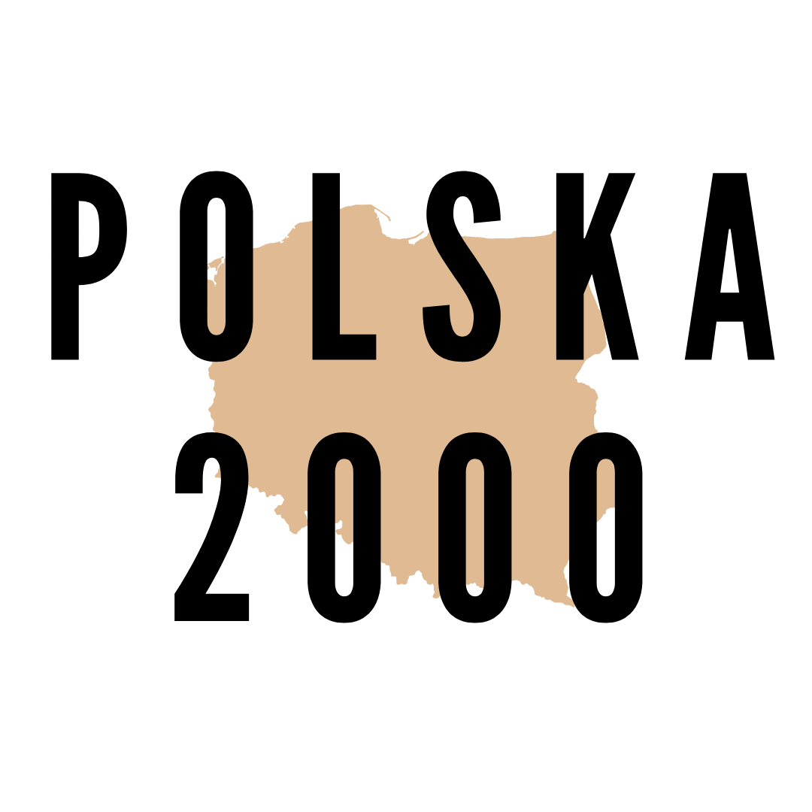

# 📊 Dawid Boratyński

**Applied Computer Science Master's Student | Analytical Support Intern at Robert Bosch GmbH**

---

### 📂 Featured Projects

| Project Name | Description | Tech Stack | Link |
| :--- | :--- | :--- | :--- |
| **[Global Super Store Report](https://sites.google.com/view/dawid-boratyski/projects/global-superstore?authuser=1)** | Comprehensive business intelligence report analyzing global sales, profit margins, and shipping efficiency. |  | [🔗 View Repo](https://github.com/Borsh8m3/Global_Super_Store_report) |
| **[New Sales Method Report](https://github.com/Borsh8m3/New_sales_method_report)** | Analytical deep-dive into the effectiveness of new sales strategies and revenue growth tracking. |     | [🔗 View Repo](https://github.com/Borsh8m3/New_sales_method_report) |
| **[Country Clustering Analysis](https://sites.google.com/view/dawid-boratyski/projects/sales-method-report?authuser=1)** | Machine Learning project using unsupervised learning to group countries based on socio-economic indicators. |     | [🔗 View Repo](https://github.com/Borsh8m3/Country_Clustering_Analysis) |
| **[AI Sign Language Interpreter](https://github.com/Borsh8m3/AI_sign_language_interpreter)** | Real-time computer vision system that translates sign language gestures into text/speech using deep learning. |    | [🔗 View Repo](https://github.com/Borsh8m3/AI_sign_language_interpreter) |
| **[AI Agents Team](https://github.com/Borsh8m3/AI_agents_team)** | Multi-agent AI framework designed for collaborative task execution and autonomous problem solving. |    | [🔗 View Repo](https://github.com/Borsh8m3/AI_agents_team) |
| **[Polska 2000](https://bit.ly/polska2000)** | Data-driven analysis of Poland's socio-economic development and historical trends. |   | [🔗 View Site](https://bit.ly/polska2000) |

### 🌐 Connect with me:

